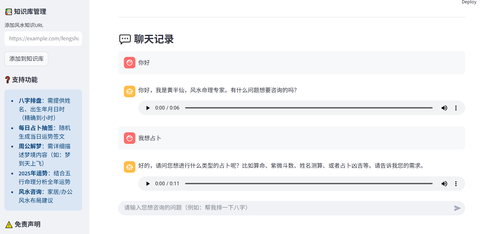

# 黄半仙风水命理助手 🔮
[](https://www.python.org/)
[](https://fastapi.tiangolo.com/)
[](https://streamlit.io/)
[](https://www.langchain.com/)
[](LICENSE)
[](https://github.com/hbl-0624/HuangBanxian_Langchain_Agent/stargazers)

✨ 一个基于 **LangChain** 和大模型的风水命理 AI 助手，支持八字排盘、每日占卜、周公解梦、运势分析、风水咨询，支持语音播报回复。  


---

## 📑 目录
- [功能亮点](#-功能亮点)
- [技术栈](#-技术栈)
- [快速开始](#-快速开始)
  - [1. 环境准备](#1-环境准备)
  - [2. 安装步骤](#2-安装步骤)
  - [3. 配置环境变量](#3-配置环境变量)
  - [4. 启动项目](#4-启动项目)
- [使用指南](#-使用指南)
- [项目结构](#-项目结构)

---

## ✨ 功能亮点
- 🔮 **八字排盘**：输入出生日期，生成命盘并解析  
- 📜 **每日占卜**：随机签文，附带解签  
- 😴 **周公解梦**：输入梦境，获取解释  
- 📊 **运势分析**：基于五行命理分析年度运势  
- 🏠 **风水咨询**：提供家居/办公风水建议  
- 🔊 **语音回复**：Azure TTS 生成语音播报  

---

## 🛠 技术栈
- **前端**：Streamlit  
- **后端**：FastAPI  
- **大模型**：OpenAI API (gpt-3.5-turbo)  
- **向量数据库**：Qdrant  
- **语音合成**：Azure TTS  
- **其他**：LangChain(Agent)、Redis  

---

## 🚀 快速开始

### 1. 环境准备
- Python `3.11+`  
- 网络连接（需访问 OpenAI API）  
- 必填 API Key：  
  - `OPENAI_API_KEY`（必填）  
  - `YUAN_MENG_JU_API_KEY`（必填，用于八字/占卜）  
  - `SERPAPI_API_KEY`（必填，用于搜索）  
  - `AZURE_TTS_KEY`（必填，用于语音播报）  
#### 如何获取 API 密钥？
##### OpenAI API Key
访问 OpenAI 官网：https://platform.openai.com/
注册 / 登录账号后，进入 "API Keys" 页面
点击 "Create new secret key" 生成密钥
国内用户可使用兼容 OpenAI API 的代理服务（如 ChatAnywhere 等）
##### 缘梦居 API Key
访问缘梦居 API 平台：https://portal.yuanfenju.com/
注册账号并完成认证
在控制台中申请 API 密钥，用于八字排盘、占卜等功能
##### SerpAPI Key
访问 SerpAPI 官网：https://serpapi.com/
注册账号后，在仪表盘获取 API 密钥
用于工具的实时搜索功能
##### Azure TTS Key
访问 Azure 门户：https://portal.azure.com/ （我用的国际版，需要信用卡）
注册账号并创建 "语音" 资源
在资源管理页面的 "密钥和终结点" 中获取 Key 和 Region
用于语音合成功能
### 2. 安装步骤
```bash
# 克隆代码
git clone https://github.com/hbl-0624/HuangBanxian_Langchain_Agent.git
cd HuangBanxian_Langchain_Agent

# 创建虚拟环境
python -m venv venv
source venv/bin/activate    # Mac/Linux
venv\Scripts\activate       # Windows

# 安装依赖
pip install -r requirements.txt
```
### 3. 配置环境变量
```bash
# Mac/Linux
cp .env.example .env
# Windows
copy .env.example .env
```

#### 编辑 .env 文件，填入你的 API Key：
```bash
OPENAI_API_KEY=你的OpenAI密钥
YUAN_MENG_JU_API_KEY=你的缘梦居密钥
SERPAPI_API_KEY=你的SerpAPI密钥
AZURE_TTS_KEY=你的Azure语音密钥
AZURE_TTS_REGION=你的Azure区域
```
### 4. 启动项目
#### 启动后端 API
```bash
python -m app.main
```
看到如下输出表示成功：
✅ 已加载代理配置（国际版 Azure 专用）：{'http://': 'http://127.0.0.1:7890', 'https://': 'http://127.0.0.1:7890'}.
🚀 黄半仙风水命理服务启动中...
📌 服务地址：http://localhost:8000
📌 接口文档：http://localhost:8000/docs
INFO:     Will watch for changes in these directories: ['G:\\code\\HuangBanxian_Langchain_Agent']
INFO:     Uvicorn running on http://0.0.0.0:8000 (Press CTRL+C to quit)
INFO:     Started reloader process [20856] using StatReload
✅ 已加载代理配置（国际版 Azure 专用）：{'http://': 'http://127.0.0.1:7890', 'https://': 'http://127.0.0.1:7890'}
INFO:     Started server process [20680]
INFO:     Waiting for application startup.
INFO:     Application startup complete.
✅ 成功连接Redis并获取用户[dba04331-0874-4b65-a246-22ffcab7e7d0]的聊天历史
😊 识别用户情绪：neutral，已更新Agent配置

#### 启动前端界面（新终端）
```bash
streamlit run frontend/streamlit_app.py
```

## 📖 使用指南

左侧栏可配置 API 地址（默认无需修改）

可添加风水知识 URL 扩展知识库

在聊天框输入示例：

"帮我排一下八字"（需姓名+出生年月日时）

"今日占卜"

"我梦见自己在飞，帮我解梦"

"分析一下我 2025 年的运势"

## 📂 项目结构
```arduino
HuangBanxian_Langchain_Agent/
├── app/                  # 后端代码
│   ├── __init__.py       #定义包 空文件       
│   ├── main.py           # FastAPI 主程序
│   ├── config.py         # 配置文件
│   └── tools/            # 工具函数（八字、占卜等）
├── frontend/             # 前端代码
│   └── streamlit_app.py  # Streamlit 界面
├── docs/
│   └── screenphotos/      # 项目效果 截图
├── requirements.txt      # 依赖列表
├── .env.example          # 环境变量示例
└── .env                  # 环境变量（忽略提交）
```

## ❓ 常见问题

API 连接失败？
检查 .env 配置 & 网络代理

语音没播放？
确认 Azure TTS 配置，或在浏览器手动点击激活

缺少 API Key 提示？
补充 .env 文件中的相关密钥


## ⚠️ 免责声明

本项目仅供 娱乐参考，所有命理分析结果不构成专业建议。
请勿过度依赖，人生运势需靠自身努力。

## 🌟 Star History

如果你觉得这个项目有帮助，欢迎点一个 ⭐Star 支持！
👉 让更多人体验 黄半仙 AI 风水命理助手 🔮

## 后续更新

后续我还会完善这个项目哒！添加更多功能，改成langgraph+MCP实现🔮
